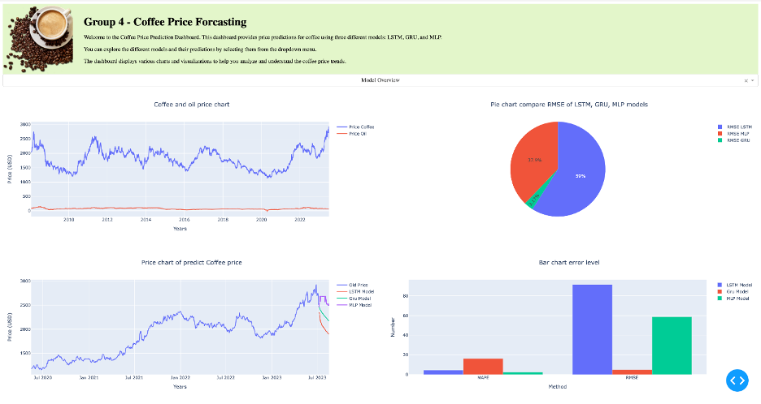
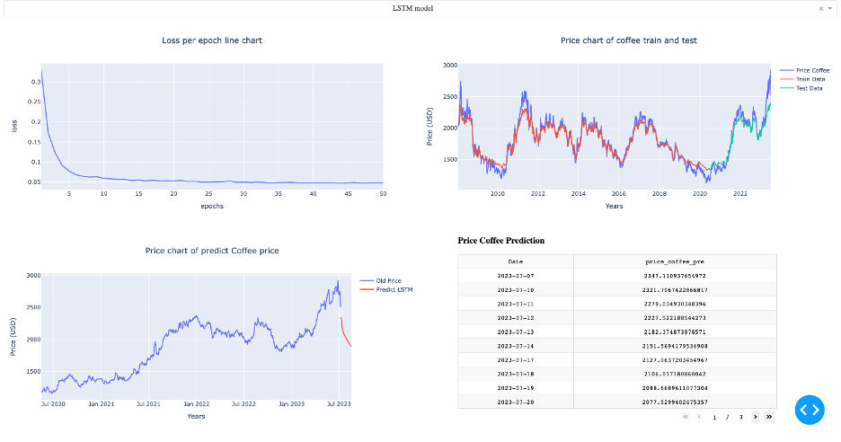
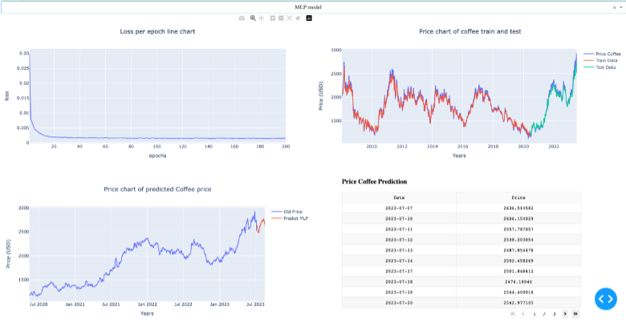
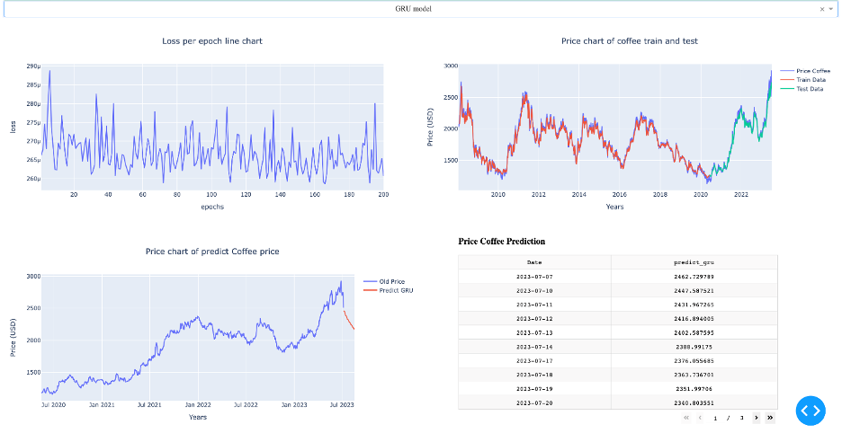

 
 
 
 

## COFFEE PRICE FORCASTING - ACCT5123.N21.CTTT

  
## CONTRIBUTORS ✨

| Avatar                | Name                 | Student ID| Role       |
|-----------------------|----------------------|-----------|-----------|
||Nguyen Nhat Thuong |20522000|LEADER, LSTM, DATASET|
||Le Quang Hoa |20521331|GRU|
||Kieu Xuan Dieu Huong |20521381|MLP|

## TECHNOLOGY STACKS ✨

### PROGRAMMING LANGUAGE ✨
 
### MODEL ✨
  - LSTM, GRU, MLP
## IMAGES ✨

|||
|-----------------------|----------------------|
|||

You can also follow my GitHub Profile to stay updated about my latest projects: 

If you liked the repo then please support it by giving it a star ⭐!

## License

